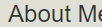
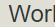
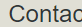

# samsons-portfolio

Check out my other [projects](https://github.com/SamsonKnightz) on github.

## Description
Here is my deployed portfolio. Inside I have work samples. You will be able to review some of my samples and contact information. When you load my portfolio, you will find my name and personal photo. You will also find links that will point you into that section. When you click on the links in the navigation, the UI scrolls down to the corresponding section. When you click click on "Work", you will see the image is larger in size than others. If you click on the image, you will be taken to the deployed application. When you resize the page or view the site on various screens, you will see a responsive layout that adapts your viewport. 

## Table Of Contents
+ [Naviagtion](#)

+ 

+ 

+ 

## Navigation

+ Hover over the top right internal links, they will underline and turn red. When clicked, you will be directed with UI, scrolling down to the corresponding section.

